### Docker integration with Jenkins

- This project demonstrates the integration of Docker with Jenkins to implement a complete CI/CD pipeline using Docker Swarm on AWS EC2 instances.

The project automates the following tasks:

- Building Docker images from source code
- Tagging Docker images dynamically
- Pushing images to DockerHub
- Deploying containerized applications using Docker Swarm
- Managing multiple replicas for High Availability (HA)

The implementation uses one Manager node and two Worker nodes to create a Docker Swarm cluster capable of running distributed containerized applications.

- Project Workflow
```bash
GitHub Repository
        ↓
Jenkins Pipeline
        ↓
Docker Image Build
        ↓
Docker Image Tagging
        ↓
Push Image to DockerHub
        ↓
Docker Stack Deployment
        ↓
Docker Swarm Cluster
```

#### Launch EC2 Instances

- Launch three Amazon Linux 3 EC2 instances
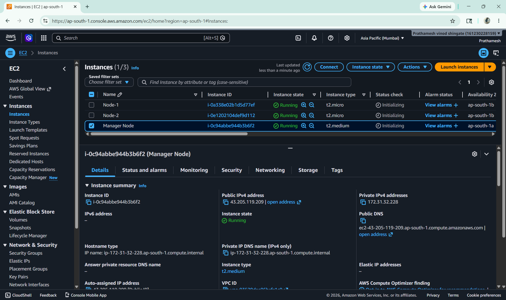

- After launching the instances, connect all machines using MobaXterm.
- Also Configure Hostnames.

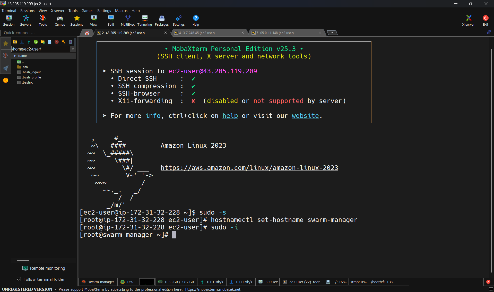

- Node 1

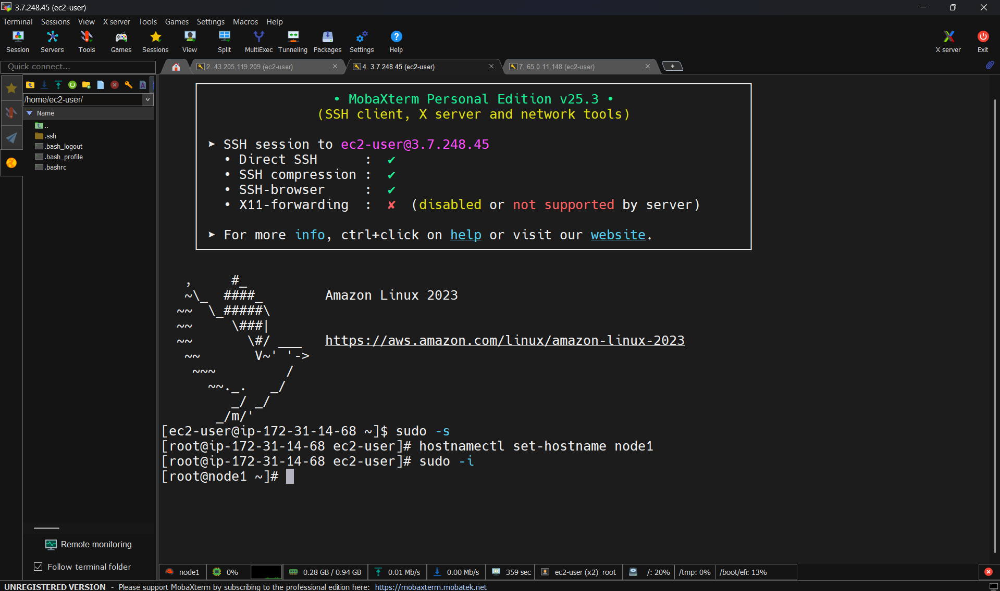

- Node 2

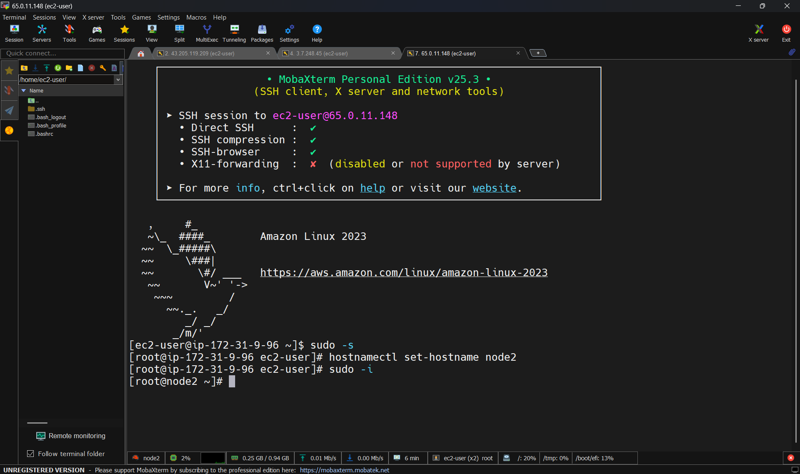

#### Install Docker on All Nodes

- Open MultiExec in MobaXterm and execute the following commands on all nodes.

```bash
sudo yum install -y docker
sudo systemctl start docker
sudo systemctl status docker
```

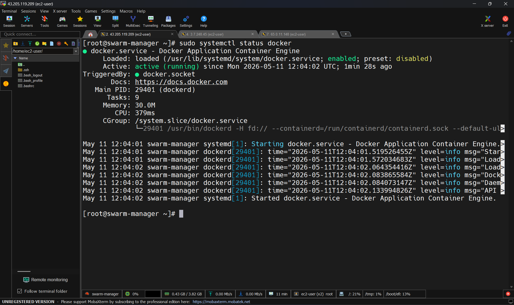

#### Initialize Docker Swarm

- Run the following command on the Manager node.
```bash
docker swarm init
```

- This command initializes the Docker Swarm cluster and generates a join token for worker nodes.

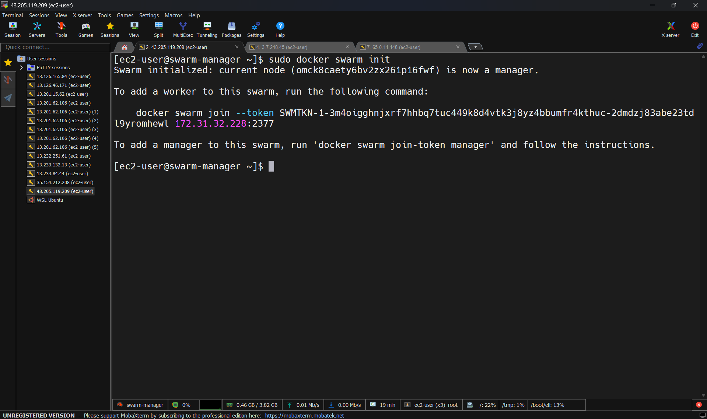

#### Join Worker Nodes to Swarm

- Worker Node 1
```bash
docker swarm join --token <TOKEN> <MANAGER-IP>:2377
```
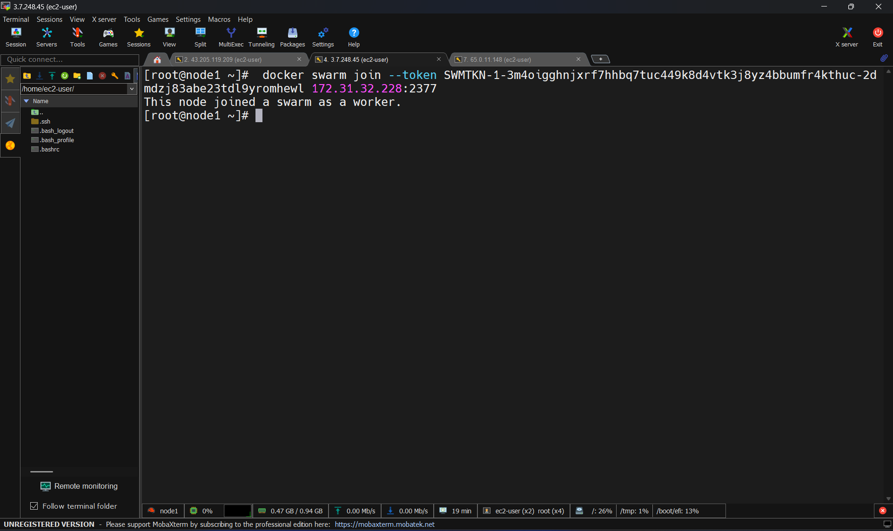

- Worker Node 2

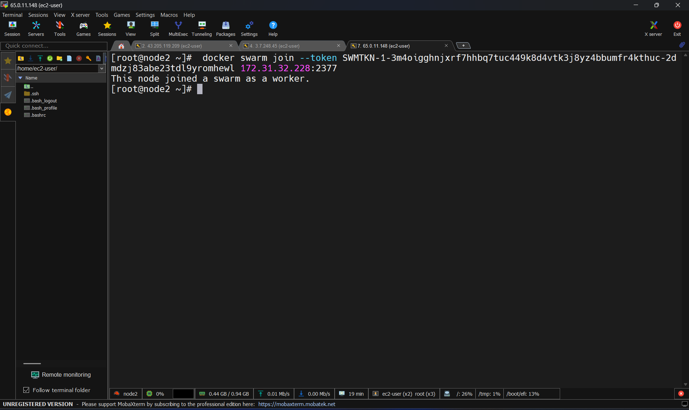

#### Install Jenkins on Manager Node

- Create a Jenkins installation script and execute it.

```bash
vi jenkins.sh
sh jenkins.sh
```
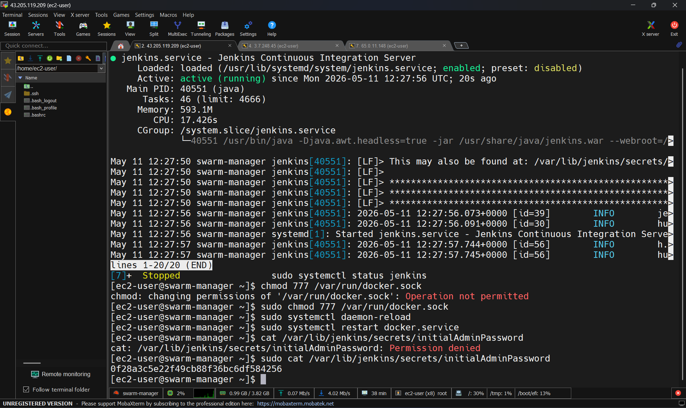

- Access Jenkins using: 

```bash
http://<PUBLIC-IP>:8080
```

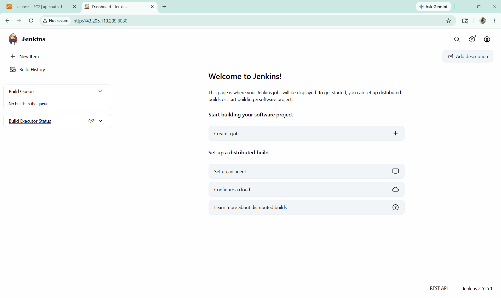

#### Create Jenkins Pipeline

- The application source code is stored in a GitHub repository containing a Dockerfile.
- Instead of creating only one image, the pipeline dynamically creates multiple images using Jenkins parameters.

Applications included:

- Internet Banking
- Mobile Banking
- Insurance
- Loans

#### Configure Jenkins Parameters

- Image Parameter
- Repo Parameter

Enable:
- This Project is Parameterized

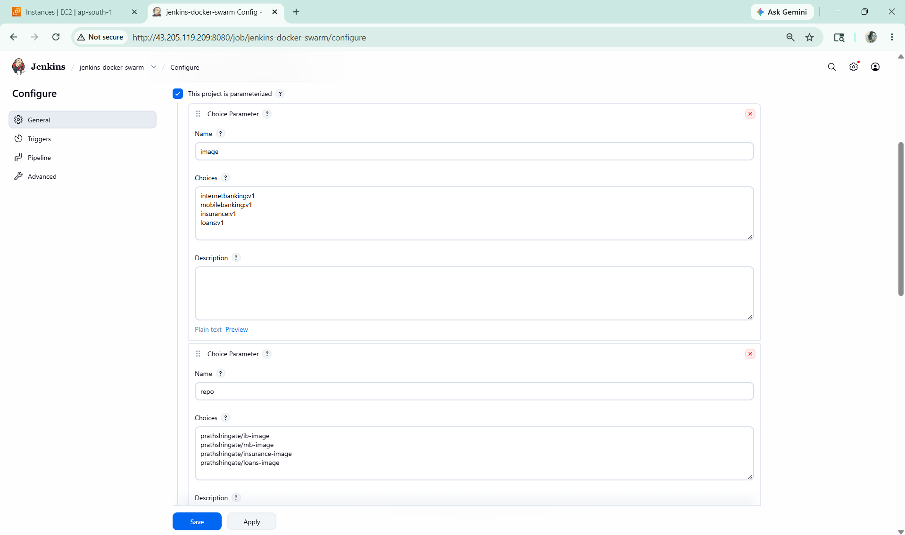

- Add this following stage in the pipeline.

```bash
 stage('checkout') {
    steps {
        git branch: 'main', url: 'https://github.com/Prathamesh311/docker-project.git'
         }
    }

stage('build') {
    steps {
        dir('jenkins-docker-swarm') {
            sh 'docker build -t $image .'
            }
        }
    }
stage('tagging') {
    steps {
            sh 'docker tag $image $repo'
        }
    }
```

#### Configure DockerHub Authentication

- Manage Jenkins → System → Environment Variables

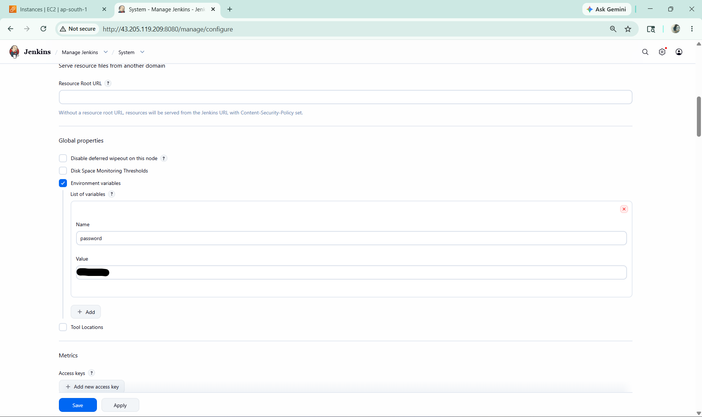

#### Push Images to DockerHub

- Add the following stage to the pipeline.

```bash
stage('push') {
    steps {
            sh 'docker login -u prathshingate -p $password'
            sh 'docker push $repo'
        }
    }
```

This stage authenticates with DockerHub and pushes the image repository.

#### Build Multiple Application Images

- Modify the index.html content in GitHub and rebuild the pipeline for different applications. like Internet Banking , Mobile Banking , Insurance , Loans.

- As a result, separate repositories and images are created in DockerHub.

#### Docker Swarm Deployment

- To achieve High Availability (HA), Docker Swarm is used for container orchestration.

- Instead of deploying containers on a single host, Docker Stack distributes replicas across multiple worker nodes.

```bash
docker-compose.yml
```

```bash
services:
  internetbanking:
    image: prathshingate/ib-image:latest
    ports:
      - "81:80"
    deploy:
      replicas: 3
    volumes:
      - /var/lib/internetbanking

  mobilebanking:
    image:  prathshingate/mb-image:latest
    ports:
      - "82:80"
    deploy:
      replicas: 3
    volumes:
      - /var/lib/mobilebanking

  insurance:
    image: prathshingate/insurance-image:latest
    ports:
      - "83:80"
    deploy:
      replicas: 3
    volumes:
      - /var/lib/insurance

  loan:
    image: prathshingate/loans-image:latest
    ports:
      - "84:80"
    deploy:
      replicas: 3
    volumes:
      - /var/lib/loan
```

#### Deploy Docker Stack

Add the deployment stage to the Jenkins Pipeline.

```bash
stage('deploy') {
    steps {
        sh 'docker stack deploy -c docker-compose.yml bank'
    }
}
```

Explanation
- -c specifies the Docker Compose file.
- bank is the Docker Stack name.

This command deploys all services into the Docker Swarm cluster.

#### build pipeline with parameters

- 
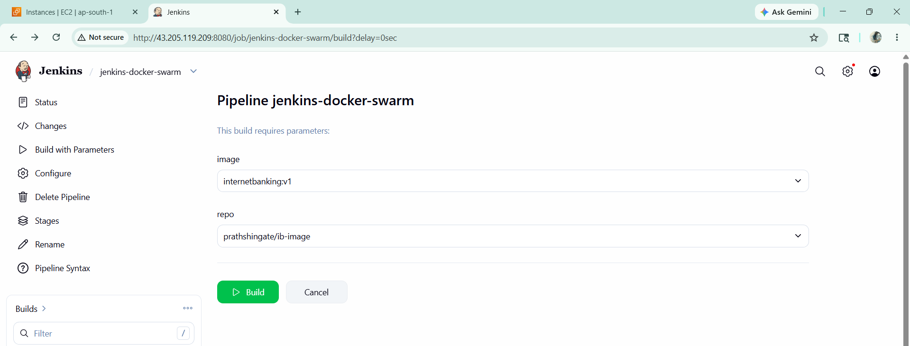

- 
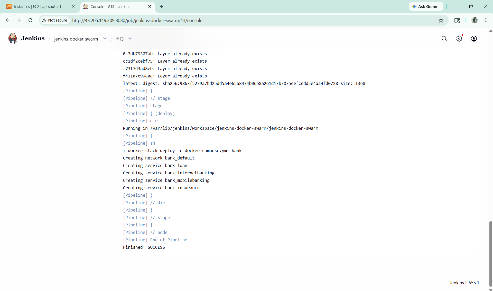

- 
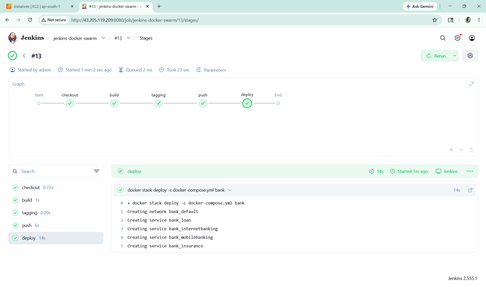

#### Verify Deployment

- List Docker Stacks
- View Stack Services
- View Running Services

```bash
docker stack ls
```
```bash
docker stack services bank
```

```bash
docker service ls
```

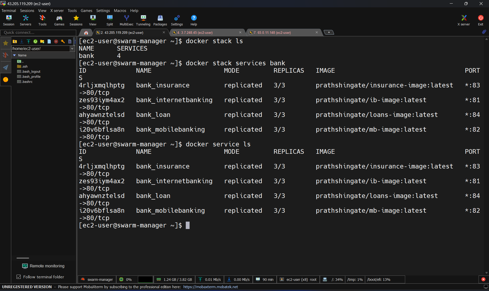

- View Service Tasks

```bash
docker stack ps bank
```

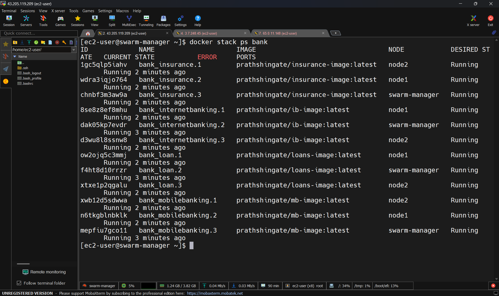


#### Advantages

- Centralized Deployment Process
- High Availability using Docker Swarm
- Easy Scaling with Replicas
- Faster Application Delivery

#### Conclusion

- This project successfully demonstrates the integration of Jenkins with Docker and Docker Swarm to implement a scalable CI/CD pipeline.
- The pipeline automates image creation, tagging, pushing to DockerHub, and deployment across multiple worker nodes using Docker Stack.

---
