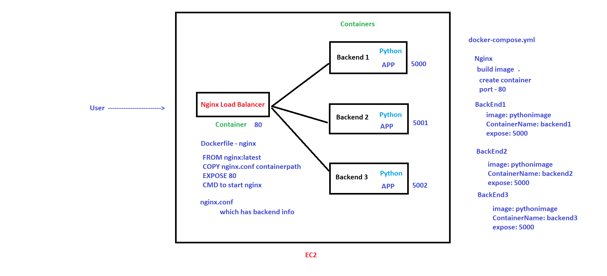
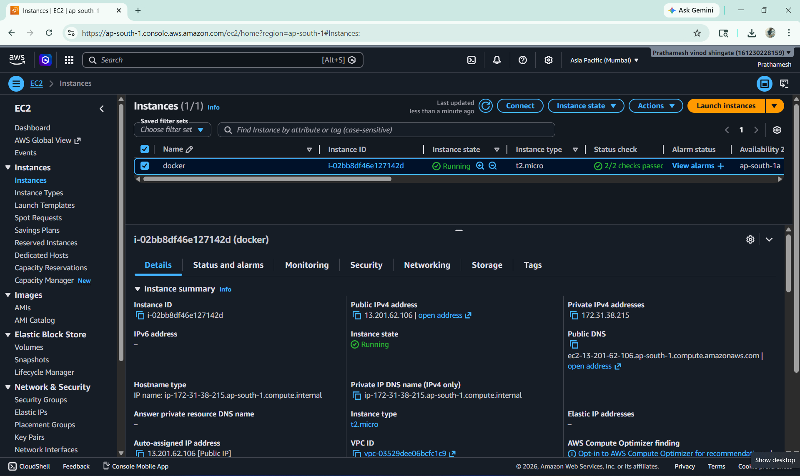
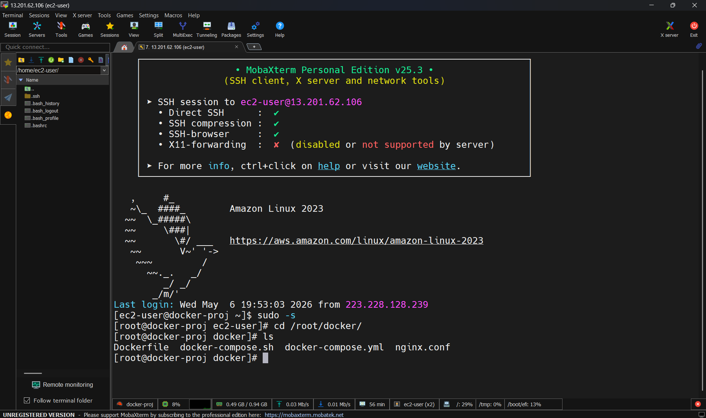
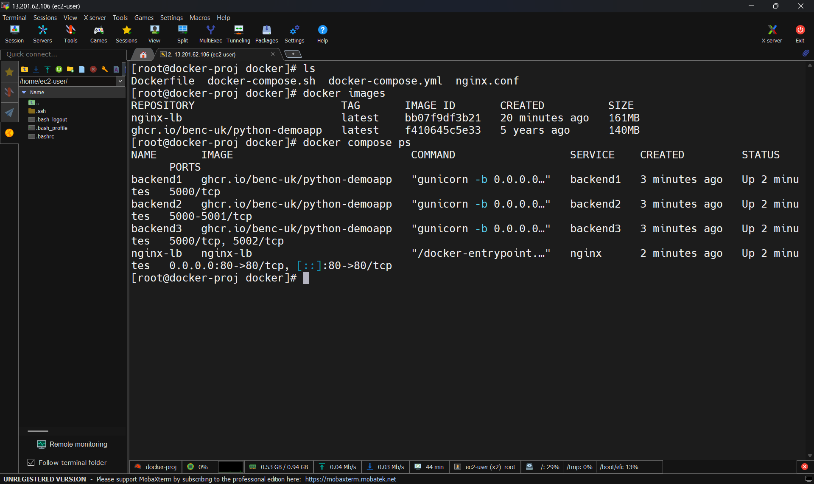
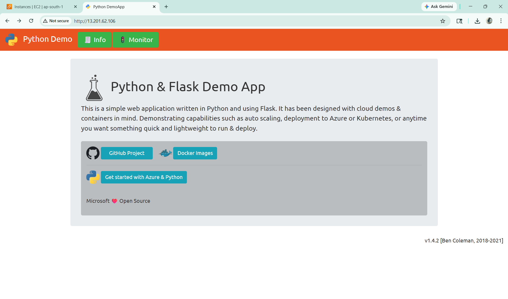
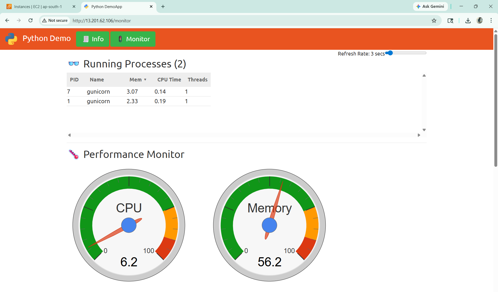
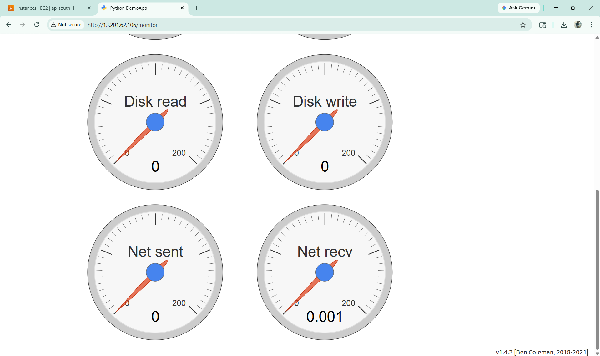

### Multi Backend Nginx Load Balancer

- This project demonstrates Load Balancing using Nginx with multiple backend containers using Docker Compose.
- Nginx Load Balancer (nginx-lb) forwards traffic to backend1, backend2, and backend3.
- Each backend service listens on different ports.

#### Project Architecture




### Implementation

#### Connect to EC2 via MobaXterm






#### Create Custom Nginx Configuration

- First, create a custom `nginx.conf` file.  
- This file is used to configure Nginx as a Load Balancer and distribute traffic between multiple backend containers.

```bash
mkdir docker-proj
cd docker-proj
```

```bash
vi nginx.conf
```

```bash
upstream backend {
    server backend1:5000;
    server backend2:5001;
    server backend3:5002;
}

server {
    listen 80;

    location / {
        proxy_pass http://backend;
        proxy_set_header Host $host;
        proxy_set_header X-Real-IP $remote_addr;
        proxy_set_header X-Forwarded-For $proxy_add_x_forwarded_for;
        proxy_set_header X-Forwarded-Proto $scheme;
    }
}
```

#### Create Dockerfile

- Now create a Dockerfile to generate a custom Nginx Load Balancer image.
- The Dockerfile copies the custom nginx.conf file into the container.

```bash
vi Dockerfile
```

```bash
# Use the official Nginx image
FROM nginx:latest

# Remove default config and copy custom nginx.conf
RUN rm /etc/nginx/conf.d/default.conf
COPY nginx.conf /etc/nginx/conf.d/

# Expose port 80
EXPOSE 80

# Start Nginx
CMD ["nginx", "-g", "daemon off;"]
```

#### Build Custom Nginx Image

- Build the custom Docker image using Dockerfile.

```bash
docker build -t nginx-lb .
```

```bash
docker run -d -p 80:80 --name nginx-lb nginx-lb
```

#### Install Docker Compose

- Install Docker Compose plugin on the server.

```bash
vi docker-compose.sh
```

```bash
sudo mkdir -p /usr/local/lib/docker/cli-plugins && \
sudo curl -SL https://github.com/docker/compose/releases/latest/download/docker-compose-linux-x86_64 \
-o /usr/local/lib/docker/cli-plugins/docker-compose && \
sudo chmod +x /usr/local/lib/docker/cli-plugins/docker-compose && \
docker compose version
```

```bash
sh docker-compose.sh
```

#### Create Docker Compose File

- Docker Compose is used to create and manage multiple containers together.

```bash
vi docker-compose.yml
```

```bash
version: '3.8'
services:
  nginx:
    image: nginx-lb:latest
    container_name: nginx-lb
    ports:
      - "80:80"
    depends_on:
      - backend1
      - backend2
      - backend3

  backend1:
    image: ghcr.io/benc-uk/python-demoapp
    container_name: backend1
    expose:
      - "5000"

  backend2:
    image: ghcr.io/benc-uk/python-demoapp
    container_name: backend2
    expose:
      - "5001"

  backend3:
    image: ghcr.io/benc-uk/python-demoapp
    container_name: backend3
    expose:
      - "5002"
```

```bash
docker compose up -d
```



```bash 
#verify running containers
docker compose ps
```

#### Access Application

- After all containers are running successfully, access the application using the EC2 Public IP.

```bash
http://<EC2-Public-IP>
```








- for removing the containers use 

```bash
docker compose down
```


